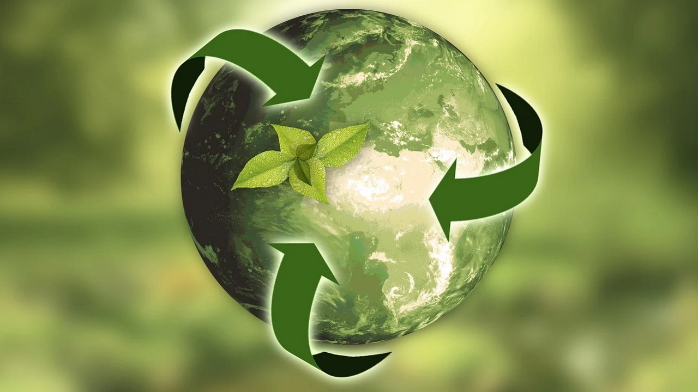

"La sostenibilidad es un concepto que busca sastifacer las necesidades del presente sin comprometer la capacidad de las generaciones futuras para sastifacer las suyas"

  <a href="README.md">🏠 Índice</a> |

